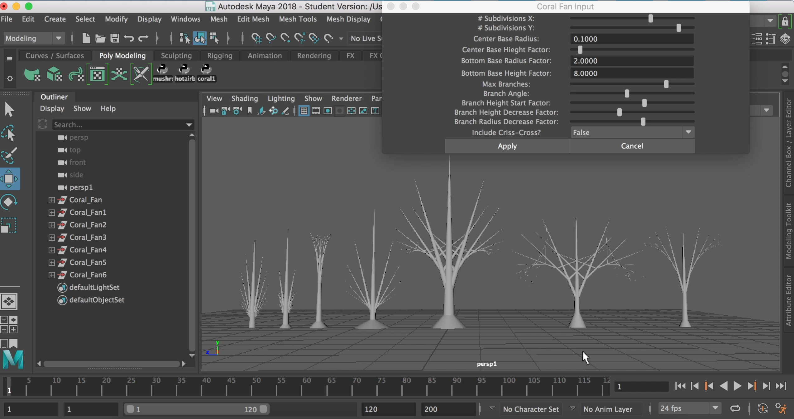

# 🐠Coral Generator Tool

This is a tool made with Maya Python scripting to generate coral fans. The user can adjust parameters of their coral fan to create a variety of differently shaped corals.

[My tool in action!](https://www.youtube.com/watch?v=gD85ZvfrPQA&t=12s)

